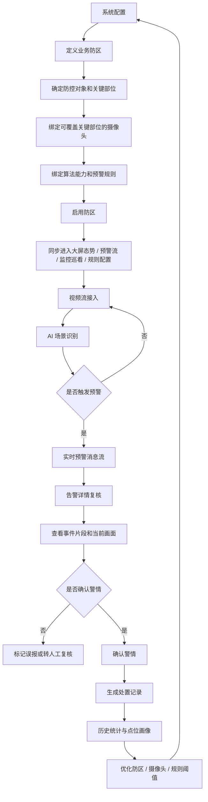
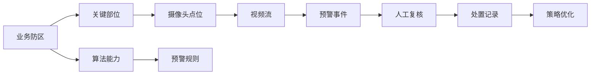

# 治安场景-产品方案

## 一、需求记录

| 版本 | 修改人 | 修改时间 | 修改内容 | 备注 |
| --- | --- | --- | --- | --- |
| v1.1.0 | 产品原型整理 | 2026.05.26 | 基于当前原型页面重写产品方案，补充业务防区定义、告警复核、监控巡看、处置记录和系统配置闭环 | 原型演示版 |

## 二、需求背景

社会面治安防控场景中，夜市商圈、医院入口、重点单位、社区车库、校园周边、农贸市场等区域人员流动大、事件类型复杂，传统方式主要依赖人工巡查、视频轮巡和事后调阅，存在发现不及时、复核成本高、处置链路分散、历史事件难以沉淀等问题。

当前原型面向“翔安区社会面治安防控智能感知系统”，以视频点位和算法能力为基础，围绕业务防区、实时预警、监控巡看、告警复核、历史处置记录形成一套闭环能力。系统不把防区定义为精确 GIS 边界，而是以“业务防控对象 + 关键部位 + 摄像头感知覆盖 + 处置联动范围”共同确定实战防区，让一线人员能够理解“管什么、看哪里、谁来处置、处置结果如何回流”。

一期原型重点覆盖以下样例场景：

- 医院急诊入口：识别医疗纠纷异常聚集，并支持横幅/举牌目标复核。
- 马巷夜市防区：识别人群异常聚集、打架斗殴、排档外摆区冲突等高频警情。
- 区政府核心圈：识别涉稳讨薪、横幅聚集等重点单位周边风险。
- 洋唐居住区地下车库：识别夜间偷盗、拉车门等行为线索。
- 校园周边、农贸市场等常态防区：纳入日常巡看和秩序类事件观察。

## 三、需求设计

### 3.1 高保真原型

原型入口：`frontend/.html`，自动跳转至 `frontend/index.html`。

当前原型主导航包括：

- 大屏态势
- 监控巡看
- 处置记录
- 系统配置

其中，预警详情以弹窗方式从大屏右侧预警消息流进入，不作为单独导航页面。

### 3.2 低保真业务结构

系统主流程如下：

1. 管理员在系统配置中启用或新建业务防区。
2. 新建防区时，先定义业务对象和关键部位，再绑定能够覆盖关键部位的摄像头。
3. 为防区绑定算法能力和预警规则。
4. 已启用防区同步进入大屏态势、预警消息流筛选、监控巡看、摄像头配置和预警规则配置。
5. 视频流持续进入算法识别，触发预警后进入实时预警消息流。
6. 值守人员打开告警详情，查看事件片段、当前画面、处置建议和置信度。
7. 确认警情后生成处置记录。
8. 历史处置记录用于查看区域、点位、事件类型的历史发生情况，并反向支撑防区和规则优化。

## 四、需求清单

| 功能模块 | 主要功能点 | 功能描述 | 优先级 |
| --- | --- | --- | --- |
| 大屏态势 | 防区态势总览 | 展示已启用重点防区、实时告警、区域状态、今日态势指标和预警消息流 | P0 |
| 大屏态势 | 实时预警消息流 | 右侧展示按时间排序的预警卡片，支持按场景或地点关键词搜索 | P0 |
| 告警复核 | 告警详情弹窗 | 统一展示事件片段、当前画面、预警内容、地点、时间、处置建议、置信度和确认警情按钮 | P0 |
| 告警复核 | 当前画面查看 | 在告警详情中查看关联点位实时画面，辅助判断现场是否仍在持续发生 | P0 |
| 监控巡看 | 自动轮巡 | 默认开启自动轮巡，按防区组织点位，主屏自动切换重点点位 | P0 |
| 监控巡看 | 同区域补充观察 | 左侧展示同区域 3 路补充点位，右侧 16:9 主屏展示当前轮巡点位 | P0 |
| 系统配置 | 区域配置 | 支持启用预置防区和新建业务防区，新建流程包括基础信息、点位绑定、能力绑定、启用确认 | P0 |
| 系统配置 | 摄像头配置 | 按防区管理摄像头点位，展示点位名称、通道号、在线状态、覆盖部位和关联能力 | P0 |
| 系统配置 | 预警规则配置 | 按防区和算法能力配置阈值、等级、ROI 和联动方式 | P0 |
| 系统配置 | 用户与角色 | 管理用户、角色、权限范围，支撑指挥中心、派出所、网格员等角色分工 | P1 |
| 处置记录 | 历史处置台账 | 记录已确认、复核、误报等事件，展示事件类型、地点、防区、处置状态和时间线 | P0 |
| 处置记录 | 事件统计分析 | 支持按时间窗口、事件类型、区域和点位查看历史发生趋势 | P1 |

## 五、名词解释

| 名词 | 解释 |
| --- | --- |
| 业务防区 | 面向治安实战定义的管控对象，不等同于行政区划或精确 GIS 边界。 |
| 防控对象 | 需要重点管控的业务对象，如马巷夜市、医院急诊入口、区政府南门广场。 |
| 关键部位 | 防控对象内需要被感知和处置关注的位置，如夜市北入口、十字路口核心区、排档外摆区、急诊入口通道。 |
| 摄像头感知覆盖 | 摄像头能够看到关键部位的能力，用于支撑告警识别和人工复核，不用于自动生成精确边界。 |
| 核心点位 | 对防区风险判断最关键的一路或多路摄像头，通常覆盖入口、核心路口、出入口通道等位置。 |
| 补充点位 | 对核心点位形成辅助观察的点位，用于查看外围通道、后门、联动位等区域。 |
| 事件片段 | 预警触发前后截取的视频片段，用于复核事件是否属实。 |
| 当前画面 | 告警关联点位的实时画面，用于判断现场是否仍在持续发生。 |
| 自动轮巡 | 监控巡看页面默认启用的轮巡模式，按防区和点位自动切换主屏画面。 |
| P0/P1/P2 | 告警或防区风险等级。P0 表示重点警情或强告警，P1 表示需要复核的线索，P2 表示常态巡看或低风险关注。 |

## 六、架构图 / 流程图

### 6.1 业务闭环流程

### 6.2 核心数据关系

## 七、详细需求

### 7.1 大屏态势

#### 7.1.1 页面目标

大屏态势用于值守人员快速掌握全区重点防区运行状态、当前告警数量、待核线索、已启用防区和实时预警消息。该页面保留一定展示感，但不承担复杂配置操作。

#### 7.1.2 页面组成

- 今日态势汇总：展示重点告警、待核线索、在线点位等核心指标。
- 布控防区实时状态：仅展示在系统配置中已启用的业务防区。
- 态势地图/区域态势：辅助表达防区分布和告警位置，不作为精确 GIS 边界。
- 实时预警消息流：展示最新预警，支持点击进入告警详情。

#### 7.1.3 预警消息流

预警卡片应保持轻量，主要展示：

- 预警类型
- 发生地点
- 发生日期和时间
- 告警等级
- 简要预警内容

右侧筛选采用搜索框形式，支持场景和地点关键词，例如“异常聚集”“冲突”“医院”“夜市”等。无需再额外提供复杂标签筛选。

### 7.2 告警详情与复核

#### 7.2.1 页面目标

告警详情用于让值守人员在有限时间内判断告警是否属实，并决定是否确认警情。页面需要标准化，不同告警类型展示结构保持一致。

#### 7.2.2 展示内容

- 事件片段：展示预警触发前后的短视频片段或模拟画面。
- 当前画面：展示关联摄像头实时画面，用于确认现场是否仍在持续。
- 预警内容：说明系统识别到的事件类型和地点。
- 发生时间：展示年月日和具体时分秒。
- 置信度：保留但占用较小空间。
- 处置建议：放在较靠上的位置，便于民警快速查看。
- 复核异常行为：仅保留算法侧可做的识别项，例如横幅/举牌识别，不展示算法无法稳定实现的行为项。
- 操作按钮：保留“确认警情”，避免按钮文案过长。

#### 7.2.3 样例场景

医院急诊入口异常聚集告警：

- 系统识别到人员异常聚集。
- 同时命中横幅/举牌识别。
- 处置建议侧重保障急诊通道、联动院方安保和属地警力、同步医患沟通力量。

马巷夜市打架斗殴告警：

- 系统识别到推搡、挥拳、追逐等肢体冲突。
- 告警详情使用打架示意图作为事件片段。
- 处置建议侧重派发巡逻组、现场隔离控场、必要时开启喊话。

### 7.3 监控巡看

#### 7.3.1 页面目标

监控巡看用于值守室持续查看重点防区的实时画面。页面不再做复杂说明文字，重点是让主画面足够大、同区域补充画面稳定可见、轮巡控制清晰可操作。

#### 7.3.2 页面布局

- 顶部：防区切换栏，展示自动轮巡和已启用防区。
- 左侧：同区域补充观察区，展示 3 路正方形补充监控画面。
- 中央/右侧：16:9 主监控大窗，展示当前轮巡点位。
- 底部：轮巡控制条，包含上一路、暂停轮巡、下一路和轮巡频率。

监控画面内部使用黑色监控底色，左上角仅保留很小的区域标注，避免文字遮挡画面。点位名称、通道号、点位角色等信息放在底部控制条中展示。

#### 7.3.3 交互规则

- 默认开启自动轮巡。
- 未选择具体防区时，系统按已启用防区轮巡。
- 选择某个防区后，主屏轮巡该防区内重点点位，左侧展示同区域补充点位。
- 点击左侧补充画面，可以切换到主屏查看。
- 轮巡频率支持 5 秒、10 秒、20 秒。

### 7.4 系统配置 - 区域配置

#### 7.4.1 页面目标

区域配置用于定义“系统要管什么区域”。当前产品不强调手动画精确边界，而是通过业务对象、关键部位和摄像头覆盖来确定实战防区。

#### 7.4.2 防区定义逻辑

一句话表达：

先定义“要管的业务对象”，再选择“哪些摄像头能看到关键部位”。

防区确定方式：

- 防控对象：例如马巷夜市、医院急诊入口、区政府南门广场。
- 关键部位：例如夜市北入口、十字路口核心区、排档外摆区、急诊入口通道。
- 摄像头感知覆盖：选择能够覆盖关键部位的摄像头。
- 处置联动范围：根据告警等级进入预警流、监控巡看或常态巡看。

说明文案：

区域不是精确地图边界，而是业务防控对象 + 摄像头感知覆盖共同形成的实战范围。摄像头用于确认关键部位是否可被感知，不用于自动生成精确边界。

#### 7.4.3 新建业务防区流程

1. 基础信息
   - 防区名称
   - 所属街道/网格
   - 业务场景
   - 风险等级

2. 关键部位与点位绑定
   - 展示当前防控对象。
   - 展示关键部位标签。
   - 用户勾选能够覆盖关键部位的摄像头。
   - 摄像头只展示点位名称、通道号、覆盖部位和在线状态。
   - 至少选择 1 路摄像头后才能进入下一步。

3. 能力绑定
   - 选择算法能力，例如人群聚集、打架斗殴、横幅/举牌、拉车门等。
   - 不展示复杂推荐理由。

4. 启用确认
   - 展示防区确定方式。
   - 展示关键部位、接入点位、核心点位、算法规则、告警联动和大屏展示。
   - 确认后默认启用防区。

#### 7.4.4 启用后的联动

新防区启用后应同步进入：

- 大屏态势防区列表
- 右侧预警消息流筛选
- 摄像头配置
- 预警规则配置
- 监控巡看

### 7.5 系统配置 - 摄像头配置

#### 7.5.1 页面目标

摄像头配置用于维护点位资产及其业务归属，说明某个点位属于哪个防区、覆盖哪个关键部位、具备哪些算法能力。

#### 7.5.2 核心信息

- 点位名称
- 通道号
- 所属防区
- 覆盖部位
- 在线状态
- 点位角色：核心点位、补充点位、入口点位等
- 关联算法能力

#### 7.5.3 与区域配置的关系

区域配置回答“要管什么对象、哪些关键部位需要看见”；摄像头配置回答“哪些设备能看见这些关键部位、设备状态是否可用”。两者不是重复关系。

### 7.6 系统配置 - 预警规则配置

#### 7.6.1 页面目标

预警规则配置用于定义某个防区在什么条件下产生告警，避免摄像头接入后所有异常都直接进入强告警。

#### 7.6.2 配置内容

- 适用防区
- 适用算法能力
- 告警等级
- 人数阈值
- 持续时长
- ROI 区域说明
- 联动方式

#### 7.6.3 与区域配置的关系

区域配置确定“在哪些关键部位看”；规则配置确定“什么程度算异常、异常后进入什么处置链路”。两者共同形成可解释的防控策略。

### 7.7 历史处置记录

#### 7.7.1 页面目标

历史处置记录用于沉淀已经发生和处理过的事件，为后续查看区域风险、点位风险和规则优化提供依据。

#### 7.7.2 记录内容

- 事件类型
- 发生地点
- 所属防区
- 关联点位
- 告警等级
- 处置状态
- 发生时间
- 确认时间
- 处置时间线
- 处置结果摘要

#### 7.7.3 历史分析

支持从以下角度查看历史发生情况：

- 按区域：例如马巷夜市防区近 7 天人群聚集情况。
- 按点位：例如某个医院入口摄像头历史横幅/聚集告警。
- 按事件类型：例如打架斗殴、异常聚集、涉稳讨薪、拉车门。
- 按时间窗口：近 7 天、近 30 天等。

历史处置记录不单独做复盘报告页面，本期重点是处置台账和统计分析，作为后续优化配置的依据。

### 7.8 用户与角色权限

#### 7.8.1 页面目标

用户与角色权限用于管理系统使用人员、岗位角色和功能访问范围，支撑指挥中心、派出所、网格员、运维人员等角色分工。

#### 7.8.2 角色样例

- 系统管理员：区域配置、摄像头配置、预警规则、用户管理。
- 指挥中心值守员：监控巡看、告警复核、处置记录。
- 派出所管理员：区域配置、摄像头配置。
- 网格员/联防员：监控巡看、预警提醒。
- 研判人员：处置记录、统计分析。

## 八、非本期范围与原型假设

- 本期为原型演示，不接真实后端。
- 不接真实 GIS 地图，不承诺防区精确地理边界。
- 防区不按手动画边界定义，而按业务对象、关键部位和摄像头覆盖确定。
- 摄像头画面为原型模拟素材，不代表真实视频流接入状态。
- 算法能力以可解释的样例展示为主，横幅/举牌、人群聚集、打架斗殴、拉车门等能力需以后端算法实际能力为准。
- 当前不保留独立复盘报告页面，处置记录和统计分析作为闭环沉淀入口。

## 九、验收标准

| 验收项 | 验收标准 |
| --- | --- |
| 大屏态势 | 能看到已启用防区、核心态势指标和实时预警消息流 |
| 预警搜索 | 预警流支持按场景或地点关键词搜索 |
| 告警详情 | 点击预警后能查看事件片段、当前画面、处置建议、置信度和确认警情 |
| 当前画面 | 告警详情中能查看关联点位当前监控画面 |
| 监控巡看 | 默认开启自动轮巡，左侧展示 3 路补充画面，右侧展示 16:9 主画面 |
| 区域配置 | 能新建业务防区，并通过关键部位与摄像头绑定解释防区确定方式 |
| 摄像头配置 | 能查看点位名称、通道号、所属防区、覆盖部位、在线状态和关联能力 |
| 预警规则 | 能按防区配置算法能力、告警等级和阈值 |
| 处置记录 | 确认警情后生成处置记录，并能按区域、点位、事件类型查看历史情况 |
| 联动闭环 | 新建防区后能同步进入大屏、预警流、摄像头配置、规则配置和监控巡看 |
